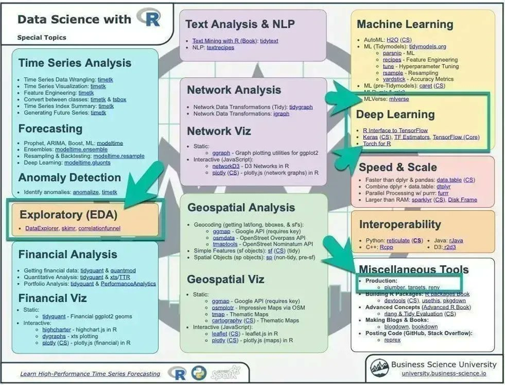

# MODEL TO PREDICT THE TIME SERIES
It is a model to predict the movements of the time series using xgboost in R.

xgboost, or Extreme Gradient Boosting is a very convenient algorithm that can be used to solve regression and classification problems.

Algorithms:

# My CV here:
 [Raúl Avilés Web Page](https://raulaviles.netlify.app/)
 
